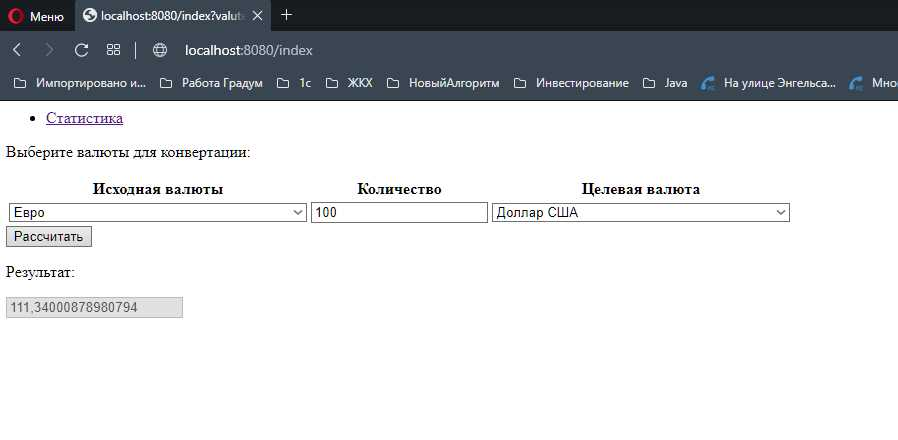
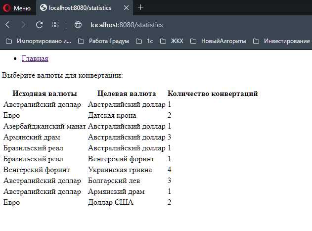

Exchange_rates
====================================================
Project: Exchange valutes (load from CBRF)
----------------------------------------------------
When the application is launched, currencies and current exchange rates are downloaded 
from the Central Bank's website. On the main page, you can convert the amount of one 
currency into another. On the statistics page, you can see the number of conversions 
over the past week by currency pairs.
The project uses Spring boot, MVC, JPA,.

Configuration
----------------------------------------------------
The project should configured the Spring Boot.

Usage
----------------------------------------------------
Выбираем валюту в поле Исходная валюта и в поле Целевая валюта, а так же количество
исходной валюты. Нажимаем кнопку Рассчитать, результат выводится снижу страницы.
При нажатии на гиперссылку Статистика переходим на страницу со статистикой конвертаций.
